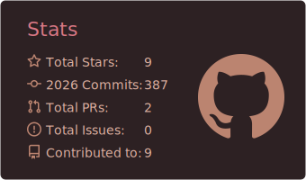
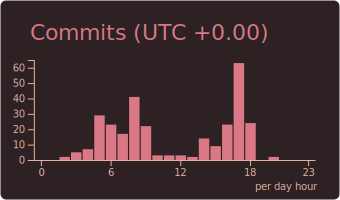
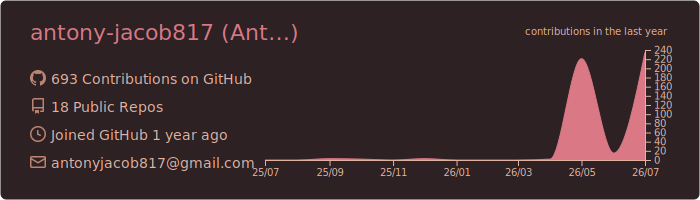

<h1 align="center">Hi there, I'm Antony Jacob! 👋</h1>

  

  

## 💫 About Me:

- 🔭 I’m currently honing my skills in full-stack development. 

- 🌱 Always exploring new technologies to stay ahead of the curve. 

- 👯 Seeking collaboration on open-source projects that create an impact. 

- 💬 Ask me about **JavaScript, Python, Cloud Technologies, and Web Development**. 

- ⚡ Fun fact: I love **hiking** and discovering new places!  
                                                             
- 🌐 Connect with Me:   

- 💻 Tech Stack: &nbsp;&nbsp;&nbsp;&nbsp;&nbsp;&nbsp;&nbsp;&nbsp;&nbsp;&nbsp;&nbsp;&nbsp;&nbsp;&nbsp;&nbsp;&nbsp;&nbsp;&nbsp;&nbsp;&nbsp;&nbsp;&nbsp;&nbsp;&nbsp;&nbsp;&nbsp;&nbsp;&nbsp;&nbsp;&nbsp;&nbsp;&nbsp;&nbsp;
 

## 📈 GitHub Activity Graph:

  <!--START_ACTIVITY_GRAPH-->
  
  <!--END_ACTIVITY_GRAPH-->

## 📊 GitHub Stats:

  

  
  
  

  

## ✍️ Random Dev Quote:

  

## 🎛️ My Contributions:

  

## ⏮️ Summary:

  

  <!--START_STREAK_CARD-->
  
  <!--END_STREAK_CARD-->

